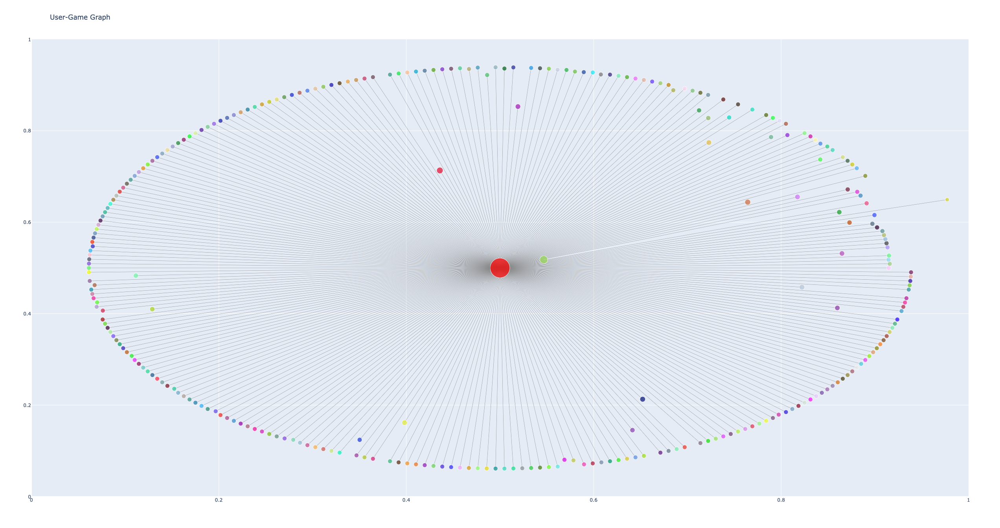

# Game Recommendation System

This game recommendation system is a Flask-based web application that helps users find recommended games based on their preferences. The recommendations are generated using a graph-based algorithm that takes into account various factors, such as user preferences, game ratings, and popularity. The application provides an interactive and user-friendly interface for users to explore and discover new games.

## Features

* User input form for specifying preferences
* Top recommended games based on the user's preferences
* Visualize the user-game graph Flask-based web application for easy interaction with the recommendation system
* Detailed game descriptions, including information such as the game's title, genres, platform, release year, and more

## Data Organization and Structure
The application retrieves game data from the Steam API and Metacritic website. This data is organized into several data structures to facilitate the recommendation process and improve the user experience:

### Game Data
Each game is represented by a Game class containing essential information:
```python
class Game():
    def __init__(self, GameID= None, Name= None, Genres= None, Free= None, Price= None, Platform= None, Categories= None, Description= None, Recommendations= 0, Rating= None, ReleaseDate= None):
        self.GameID = GameID
        self.Name = Name
        self.Genres = Genres
        self.Free = True if Free == "TRUE" else False
        self.Price = Price
        self.Platform = Platform
        self.Categories = Categories
        self.Description = Description
        self.Recommendations = int(Recommendations) if Recommendations.isnumeric() else 0
        self.Rating = int(Rating) if Rating.isnumeric() else 0
        self.ReleaseDate = ReleaseDate
        self.Image = f"https://cdn.akamai.steamstatic.com/steam/apps/{self.GameID}/header.jpg"
```
Example:
```python
game = Game("Half-Life 2", ["Action", "Adventure"], "PC", 2004, 96, 220)
```
### User Preferences
User preferences are stored in a User class:
```python
class User:
    def __init__(self, UserID=None, Genres=None, Free=None, Categories=None, Platform=None, ReleaseYear=None):
        self.UserID = UserID
        self.Genres = Genres
        self.Free = Free
        self.Categories = Categories
        self.Platform = Platform
        self.ReleaseYear = ReleaseYear
```
Example:
```python
user = User('A', 'Action', False, 'Online PvP', 'windows', 2022,)
```
### Graph Data Structure
The recommendation algorithm uses a graph data structure to represent relationships between users and games. Nodes represent games, and edges represent user preferences, with edge weights indicating the strength of the connection between a game and the user's preferences.


## Getting Started
### Prerequisites
* Python 3.x
* Required Python libraries: requests, beautifulsoup4, dateutil, numpy, plotly, Flask

### Installation
1. Clone the repository:
```bash
git clone https://github.com/visuttha-m/SI507-Final-Project 
```

2. Install required Python libraries:
```bash
pip install -r requirements.txt
```

### Configuration
#### Steam API Key
This program requires a Steam API key. You can obtain one by registering your project at https://steamcommunity.com/dev/apikey.

Create a file called SteamSecrets.py in the root directory of the project, and add your Steam API key as follows:

```python
STEAM_API_KEY = "your_steam_api_key"
```

### Usage
#### Running the Program
To run the program, open a terminal in the project directory and execute the following command:
```bash
python app.py
```

#### Interacting with the Program
1. Open a web browser and navigate to http://localhost:5000 to access the web application.
2. Enter your preferences (e.g., genre, platform, release year, free/paid), and submit the form.
3. Click on the game title or image to view more detailed game information.

## Acknowledgments
* Valve Corporation for providing the Steam API.
* Metacritic website for proving the Game Rating
* Special thanks to WallpaperAccess for providing the background images used in the application.
